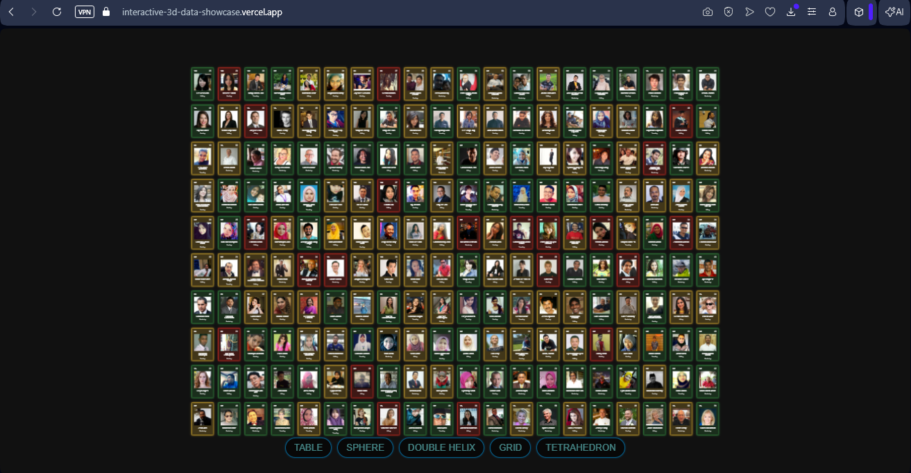
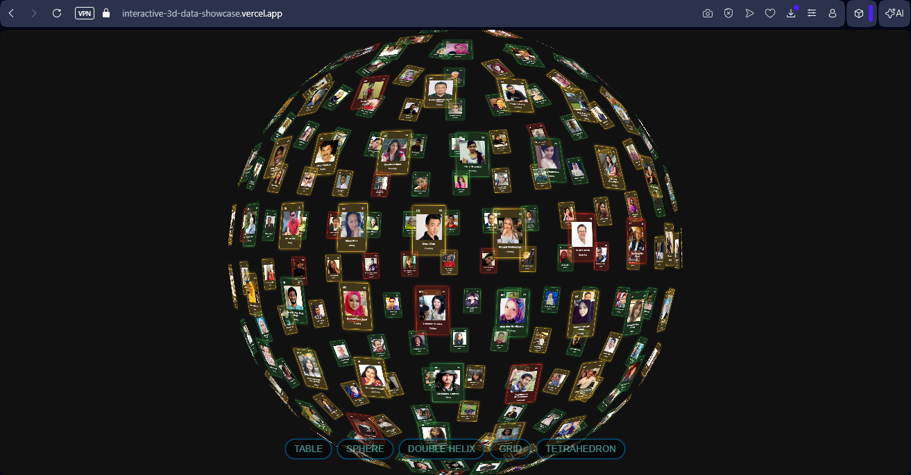
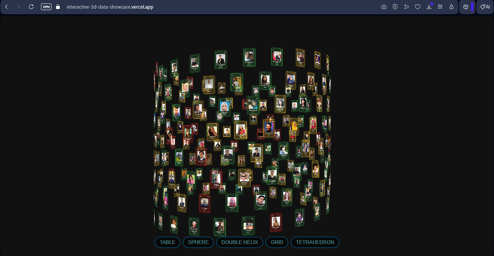
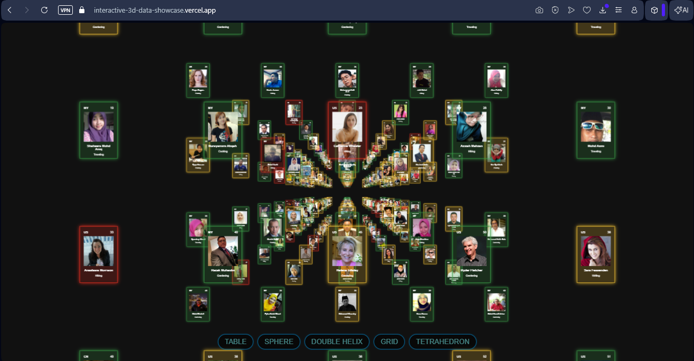
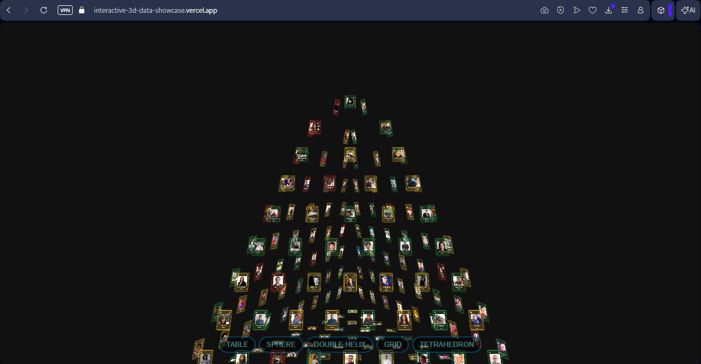

# 🌐 Interactive 3D Data Showcase

> A technical assignment given **7 days** to complete — shipped in **2 days**, with an extra feature request delivered the same night it was asked.

A 3D interactive data visualization web app built with **Vanilla JS/TS**, **Vanilla CSS**, and **Three.js CSS3D** — no frameworks, no UI libraries. Real people data rendered across 5 stunning 3D layouts, color-coded by net worth, with Google OAuth and Google Sheets integration.

🔗 **Live Demo:** [interactive-3d-data-showcase.vercel.app](https://interactive-3d-data-showcase.vercel.app)

---

## 📸 Preview

> 5 visualization modes — all transitions are smooth and animated.

### **Table Mode**


### **Sphere Mode**


### **Double Helix Mode**


### **Grid Mode**


### **Tetrahedron Mode**


---

## 🧠 The Story

This project was built as a technical assignment for **[Kasatria Technologies](https://kasatria.com)** — a digital marketing and business transformation firm with offices across the UK, Singapore, Malaysia, and Vietnam.

The brief: build a Three.js-based 3D data visualization tool, inspired by the [CSS3D periodic table demo](https://threejs.org/examples/#css3d_periodictable), within **7 days**.

Here's how it actually went:

| Date | What happened |
|---|---|
| Nov 19, 2025 | Started from scratch. Built login, Google Sheets integration, and all 4 visualization modes. |
| Nov 19, 2025 | Deployed to Vercel. Assignment submitted — **on day 2.** |
| Nov 20, 2025 | Director personally emailed requesting a 5th mode: a 4-face tetrahedron pyramid. |
| Nov 20, 2025 | Tetrahedron mode shipped **the same night.** |
| Nov 21, 2025 | Bug fixed. Added version update logs as a personal touch — nobody asked for it. |
| Dec 4, 2025 | Received a job offer as Software Developer at Kasatria. |
| Mar 13, 2026 | Added public CSV mode so anyone can explore the app without a Google account. |

---

## ✨ Features

- **5 Visualization Modes** — Table, Sphere, Double Helix, Grid, Tetrahedron
- **Color-coded tiles** by net worth (🔴 Red < $100K · 🟠 Orange > $100K · 🟢 Green > $200K)
- **Google OAuth 2.0** — secure sign-in
- **Google Sheets API** — live data from a connected spreadsheet
- **Local CSV fallback** — public access without requiring a Google account
- **Smooth 3D transitions** between all modes
- **In-app update logs** — version history visible inside the app itself

---

## 🗂️ Visualization Modes

| Mode | Layout | Notes |
|---|---|---|
| Table | 20 × 10 | Flat periodic-table style |
| Sphere | Spherical wrap | All tiles distributed on a sphere surface |
| Helix | Double helix | Custom — the double helix was implemented from scratch, distributing tiles across two mirrored helical paths simultaneously |
| Grid | 5 × 4 × 10 | 3D layered grid |
| Tetrahedron | 4-face pyramid | Added on director's request, shipped same night |

---

## 🛠️ Built With

- **Vanilla JavaScript / TypeScript** — no frontend framework
- **Vanilla CSS** — no UI library
- **Three.js** (CSS3D Renderer)
- **Vite**
- **Google OAuth 2.0**
- **Google Sheets API**
- **PapaParse** — CSV parsing for public mode
- **Vercel** — deployment

---

## 🚀 Getting Started

```bash
# Clone the repo
git clone https://github.com/your-username/interactive-3d-data-showcase.git
cd interactive-3d-data-showcase

# Install dependencies
npm install

# Set up environment variables
cp .env.example .env
# Then fill in your credentials in .env

# Start dev server
npm run dev
```

---

## 📦 Changelog

| Version | Date | What changed |
|---|---|---|
| **v1.03** | Mar 13, 2026 | Added local CSV sign-in mode via PapaParse, redeployed for public access |
| **v1.02** | Nov 21, 2025 | Fixed tetrahedron mode, added in-app update logs **(personal touch)** |
| **v1.01** | Nov 20, 2025 | Tetrahedron mode — director's request, shipped same night |
| **v1.0** | Nov 19, 2025 | Table, Sphere, Double Helix, Grid modes — deployed to Vercel |
| **v0** | Nov 19, 2025 | Project setup, Google OAuth, Sheets API, 3D rendering foundation |

---

## 📄 Assignment Brief

The original assignment document is included for context — it shows the full scope of what was asked.

📎 [`Kasatria_Assignment_Instructions.pdf`](./Kasatria_Assignment_Instructions.pdf)

---

## 📄 License

MIT